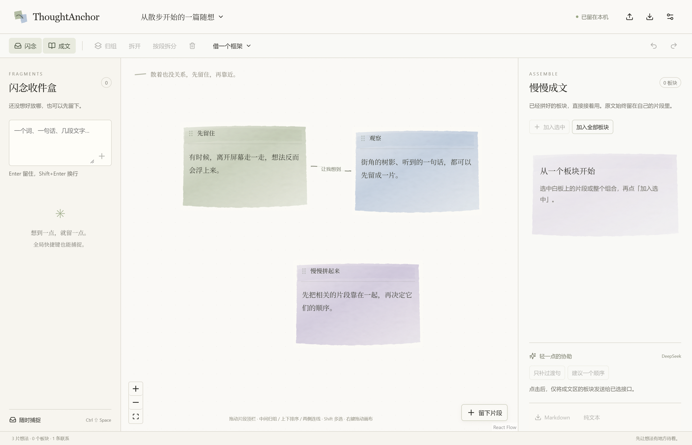
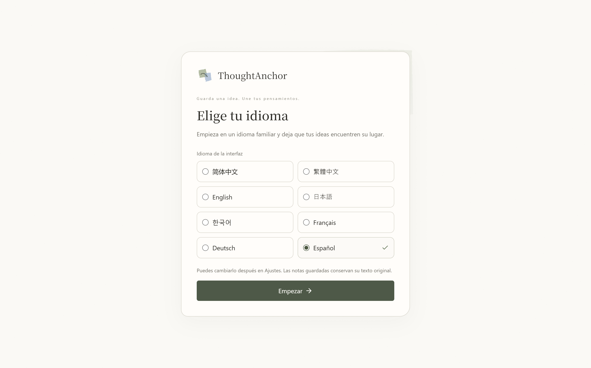

# ThoughtAnchor · 思维拼图

把闪念留住，把思路拼起来。

[简体中文](README.md) · [繁體中文](docs/i18n/zh-TW.md) · [English](docs/i18n/en-US.md) · [日本語](docs/i18n/ja-JP.md) · [한국어](docs/i18n/ko-KR.md) · [Français](docs/i18n/fr-FR.md) · [Deutsch](docs/i18n/de-DE.md) · [Español](docs/i18n/es-ES.md)

本项目完全由 **Codex 构建**：维护者提出需求与产品方向，Codex 完成项目代码、界面、测试、文档及打包发布流程。项目使用第三方开源组件，其许可分别保留。源码采用 [MIT 许可](LICENSE)，允许自由使用、修改、分发和商用，无需事先申请；复制或分发时保留版权和许可声明。软件按现状提供。

[下载 Windows / Android](https://github.com/kkaede4444/ThoughtAnchor/releases/latest) · [文档目录](docs/README.md) · [接口配置](docs/providers.md) · [安全说明](SECURITY.md)

ThoughtAnchor 是一个支持 Windows 和 Android 的本地白板。想法可以先散着存在，再通过归组、排序和连线接成可复用的板块。成文直接引用原片段，不需要从头抄写一次。

我做 ThoughtAnchor，是想让自己和 ADHD 人群散乱的思维有一个更容易整理的地方。想法来了可以先放下，等有余力时再拖动、归组、连线，把它们慢慢接起来。希望少消耗一点整理所需的耐心，把更多注意力留给想法本身，让进入心流容易一些。

因此，这里从“先留住”开始：随手记下就能保存，原文可以反复复用，整理和绘图都能撤销。你可以按自己的节奏一点点推进，不必先想清楚整篇文章的结构。

0.5.0 支持 Android 手机界面、平板 PC 布局与可切换的界面模式，所有设备都有画笔、橡皮擦和笔迹撤销。设置中的“直接在卡片上绘制”默认关闭，开启后每笔自动保存到落笔的卡片；绘图小窗继续保留，并显示卡片文字。手机与运行中的 Windows 可以配对进行局域网自动同步，冲突思路纸保留两份。安装 APK 后直接使用，Android 8.0 以上需要较新的系统 WebView。[Android、画笔及同步说明](docs/android-runtime.md)。

0.3.0 使用原生 Windows 窗口和系统 WebView2，已移除 Electron 与 Node 运行时。免安装 EXE 约 7.5 MB；体积改善是本机成品测量，不代表所有白板场景的帧率都会提升。迁移与验证说明见 [原生运行时](docs/native-runtime.md)。

原创暖白纸面、水彩颗粒和逐笔铺开的加载图示，让整理像在纸上慢慢动手。



首次使用会先显示八种语言的选择页，预选系统语言，点击“开始使用”后进入工作台。“从散步开始的一篇随想”的标题、三张卡片和连线说明使用所选语言。以后可在设置中切换界面语言，已保存的笔记保留原文；已有用户升级不重复显示选择页。



## 使用

下载 Release 中的 Windows x64 安装包（`nsis.exe`）或免安装版（`portable.exe`），也可解压 `portable.zip` 后运行 `ThoughtAnchor.exe`。支持 Windows 10/11，需要系统 WebView2 Runtime 与 .NET Framework 4.8。关闭主窗口后驻留托盘，托盘菜单可退出。发布包暂未购买代码签名证书。

1. **留住闪念**：在收件盒写下内容，Enter 保存并继续，Shift+Enter 换行。程序运行时按 `Ctrl+Shift+Space` 可从其他应用打开快速捕捉窗。中文输入法确认候选字不会提交。
2. **摊到纸上**：从收件盒放入片段，或点击白板右下角「留下片段」新增。长文本、多行粘贴完整保留；「按段拆分」需要你主动点击。
3. **拼起来**：从卡片任意普通区域拖动。靠近另一片时，中间归组、上下排前后、两侧建立关系；松手提交一个可撤销操作。组内卡片可重排、拖出或放入其他组合。双击标题或正文进入编辑，编辑时保留文字选择和输入法行为。
4. **直接复用板块**：给组合命名、折叠、整组移动，或拆回原片段。框架提供命名空位，可以放入片段或已有组合。
5. **慢慢成文**：选中片段或整个组合，点「加入选中」。可拖动或用上下按钮排序。AI 结果先预览，点击「采用稿件」后成为独立的当前稿件；可继续编辑、撤销并在重启后恢复。原文和稿件均可导出 Markdown 或纯文本。

默认左键拖动白板空处平移，右键点击卡片增减选中；开启「框选工具」后左键拖动空白处框选。移动画布、框选、画笔与橡皮擦记住上一个工具，双击画布切回上一个，再双击切回当前工具，悬停工具按钮显示用法。保留 Shift 多选、滚轮缩放，左下角可查看全部。撤销与重做在工具栏左侧，也可使用 `Ctrl+Z`、`Ctrl+Y`。选中卡片后右上角显示小 ×，点击删除该卡片；Delete 或工具栏删除按钮可删除全部选中卡片，都可撤销。框架在当前视野附近生成并自动调整视野以完整显示。在文字输入框内保留原生文字编辑快捷键。

每张卡片有上下左右四个双向圆点：先点击起点，再点击另一张卡片的圆点。一点可连接多张卡片，相同端点组合反复或反向点击不会重复；不同端点组合允许保留多条线。点击空白或 Esc 取消待连接。手动线保留所选圆点，拖动吸附生成的关系按距离选择最近的圆点，移动后重新计算。点击连线或关系名称选中，两端显示流动虚线框；使用删除按钮逐条移除，减少动态效果时显示静态虚线。

## AI：可选的轻协助

没有密钥也能使用全部白板功能。预置 DeepSeek、OpenAI、Claude、Gemini、硅基流动、Groq、OpenRouter、GLM、Kimi、Qwen、MiMo、MiniMax、Grok、腾讯混元，支持 OpenAI 兼容、Anthropic Messages、Gemini GenerateContent 三类协议，可以填写其他厂商的自定义地址和模型名称。OpenAI 兼容接口不支持 JSON 模式时可以关闭该选项，本地的内容与结构校验仍然有效。

- **拼接**：模型仅返回片段 ID 顺序和衔接文字，程序插入逐字保留的原文。默认严格使用当前顺序；开启「允许 AI 重排」后仍要求全部片段恰好出现一次。衔接文字跟随原文语言，不再限制为中文 24 字。
- **美化**：优先使用当前稿件，包括用户修改；没有稿件时使用成文区原文。按界面语言输出，必要时翻译，并按所选文风小幅润色。提示词要求保留观点、事实、人物关系与核心表达，不添加新情节。
- **拼接＋美化**：依次执行两个阶段，共享取消操作，每阶段最多 60 秒。美化失败时保留有效的拼接预览，可采用或直接重试美化。
- 原卡片始终不被 AI 回写。每张思路纸只保存一份当前稿件，再次采用会替换，支持撤销。等待或采用时来源内容、顺序、当前稿件或生成选项改变，旧结果会被拒绝；已经保存的稿件保留并提示来源变化。
- 点击按钮后才发送所选操作所需的**成文区内容或当前稿件**；收件盒和其他思路纸不发送。没有自动调用、遥测或云同步。
- 密钥通过 Windows DPAPI 使用当前用户账户加密，按接口协议与基础地址隔离保存，不进入导出文件。首次启动尝试解密旧 Electron 密文并重新加密，原密钥文件和 Local State 保留；解密失败的接口需在设置中重新保存。不能防止能读取当前 Windows 用户账户的恶意软件。

预设模型是可编辑的起点，厂商可用模型和权限会变化。官方协议参考：[DeepSeek](https://api-docs.deepseek.com/)、[OpenAI](https://developers.openai.com/api/docs/)、[Anthropic](https://platform.claude.com/docs/en/api/messages)、[Gemini](https://ai.google.dev/gemini-api/docs/generate-content)、[硅基流动](https://docs.siliconflow.cn/docs/api/chat-completions-post)、[Groq](https://console.groq.com/docs/openai)、[OpenRouter](https://openrouter.ai/docs/quickstart)。

新增接口的官方地址、地区密钥、默认模型与兼容参数见 [接口配置](docs/providers.md)。

设置支持简体中文、繁体中文、English、日本語、한국어、Français、Deutsch、Español。切换语言不会改动原卡片或已保存稿件。文学传统默认依次跟随大陆中文、台湾中文、美国、日本、韩国、法国、德国、西班牙现代文学；手动选择后保持该选择，恢复「自动跟随语言」才重新跟随。表达风格可选自然随笔、克制抒情、叙事散文、轻诗意，默认自然随笔，也可以填写自定义要求。

## 本地数据与备份

思路纸、全局收件盒、捕捉草稿和设置在 `%APPDATA%/ThoughtAnchor/data`（实际路径可通过设置的文件夹按钮打开）。命令按顺序保存，写入临时文件并刷新后替换主文件，成功后才确认捕捉。主文件保留两份最近版本备份；损坏时从备份恢复并保留损坏文件。

本地工作区与含笔迹的 `.thoughtanchor` 使用 v3 格式，继续读取 v1/v2；没有笔迹的导出保持 v2。v1 升级前保留 `workspace.json.v1-backup`，首次写入 v3 额外保留 `workspace.v2-backup.json`，旧关系补为自动就近连接。旧原文、标签、收件盒及设置保留，旧界面语言为简体中文。

`.thoughtanchor` 导入/导出包含一张思路纸及其结构、端点与连接方式、过渡句、独立稿件及来源信息，不含密钥、全局设置、收件盒和其他项目。导入创建副本，不覆盖已有纸。重要内容请定期导出到自己的备份位置。撤销历史仅保留本次运行最近 100 步。

## 开发

Node.js 24 LTS、Windows x64、WebView2 Runtime、.NET Framework 4.8。无需安装 Rust、C++ Build Tools 或 .NET SDK；构建脚本从 NuGet 获取固定版本的 WebView2 SDK、Newtonsoft.Json 与 Roslyn 编译器。

```sh
npm ci
npm run dev
npm test
npm run security
npm run build
npm run test:native
npm run smoke
npm run package
```

`npm run dev` 编译并启动本机原生应用；修改后需重新编译。`npm run package` 仅在本机输出 NSIS 安装包、portable EXE 和 ZIP 到 `release/`，不上传发布文件。打包使用 NSIS，可用 `NSIS_DIR` 指定已有目录；未找到时下载官方工具。

`npm run smoke` 是完整原生回归的别名，使用独立临时数据目录，结束后退出。日常应用可通过 `THOUGHTANCHOR_DATA_DIR` 或 `--data-dir` 指定数据目录。中性示例见 [example.thoughtanchor](docs/example.thoughtanchor)，可以直接从工具栏导入。

`npm run test:native` 需要先完成生产构建。它启动真实原生 EXE，通过 WebView2 的 Chromium 调试协议发送鼠标和键盘事件，检查白板、文件读写、捕捉及八语言；AI 使用本机模拟 HTTP 服务。独立进程重启验证稿件、捕捉和加密密钥恢复。调试端口及测试导出路径只在显式 `--automation-port` 且指定隔离目录时启用。设置 `THOUGHTANCHOR_TEST_EXE` 可以验证实际 portable EXE。

代码结构：`native` 是 Windows 窗口、托盘、快捷键、串行持久化、DPAPI 与 HTTP；`src/native` 在隔离的 WebView2 上下文中复用 `src/shared` 的文档规则；`src/main/ai.ts` 保留 AI 请求构造和内容校验，`src/main/store.ts` 作为原存储测试参考；`src/renderer` 是工作台与 SVG 水彩。界面通过窄消息接口调用原生层，不能访问文件、Node 或密钥。浏览器引擎由系统提供。

验证记录见 [docs/verification.md](docs/verification.md)。本项目旨在降低保存和整理想法的操作阻力；实际是否更容易进入心流由使用体验决定。

## English

Read the complete [English user and developer guide](docs/i18n/en-US.md).

ThoughtAnchor is a local-first Windows and Android thinking board. Capture fragments globally, drag whole cards, connect any of their four ports, and organize reusable groups. Optional AI assembles exact original text, lightly polishes a separate draft, or runs both stages. Results need adoption before saving; your cards are preserved. Eight interface languages, editable and recoverable drafts, Markdown/plain-text export, offline core, MIT license.

Visual direction is inspired by Anthropic's editorial rhythm and watercolor charts. All artwork is original SVG/CSS. Bundled Noto Serif SC is licensed under SIL OFL; see [third-party notices](docs/third-party-notices.md).
